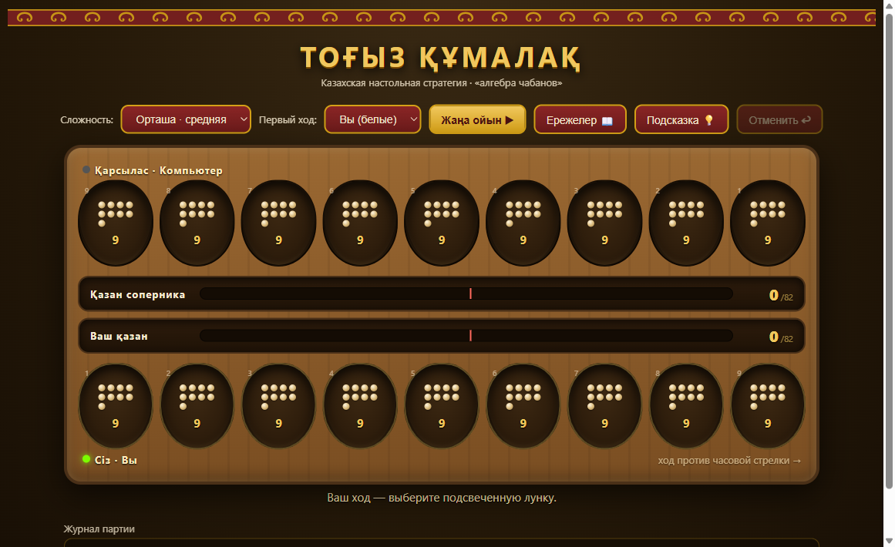

# ⚪ Тоғыз құмалақ

Древняя казахская настольная стратегия («алгебра чабанов») на чистом HTML5 — без фреймворков и сборки.

**Играть:** https://yesetsissenov.github.io/togyz-kumalak/



## Особенности

- **Правила соблюдаются жёстко** — движок (`engine.js`) реализует официальные правила и покрыт 313 проверками (`test.mjs`): раскладка с оставлением одного кумалака, захват по чётному (жұп), тұздық со всеми тремя ограничениями (один за партию, не в 9-й лунке, не симметрично тұздық соперника), поглощение кумалаков тұздықом, атсырау, победа при 82, ничья 81:81. Инвариант «162 кумалака» проверяется на 200 случайных партиях.
- **Три уровня сложности**:
  - *Оңай* — случайные ходы с редкими захватами;
  - *Орташа* — минимакс на 2 полухода;
  - *Қиын* — альфа-бета на 6 полуходов с сортировкой ходов (в тестах обыгрывает лёгкий уровень 5+ из 6 партий).
- **Правила объясняются**: обучающий экран при первом входе (с примерами), журнал партии комментирует каждый захват и тұздық, нелегальные клики получают объяснение причины, кнопка-подсказка 💡 показывает ход сильного ИИ.
- Анимация раскладки по лункам, отмена хода, выбор первого игрока, казахский орнаментальный стиль.

## Правила вкратце

Берёте все кумалаки из своей лунки (один остаётся), раскладываете против часовой стрелки. Последний кумалак сделал лунку соперника чётной — забираете её содержимое в казан. Сделал ровно 3 — лунка становится вашим тұздықом и кормит казан до конца партии. Цель — 82 кумалака.

## Запуск и тесты

```bash
python -m http.server 8080   # любой статический сервер, открыть index.html
node test.mjs                # 313 проверок движка
```

## Структура

- `engine.js` — чистый движок правил (state → state, без DOM)
- `ai.js` — три уровня ИИ (negamax + альфа-бета)
- `game.js` — интерфейс, анимации, журнал
- `test.mjs` — тесты правил и ИИ
